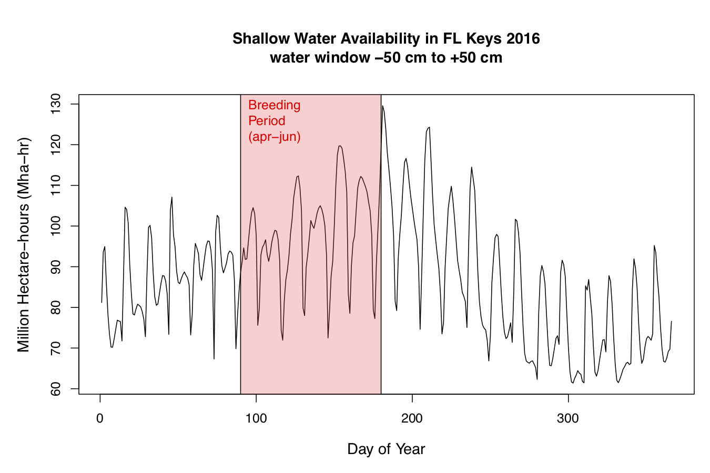
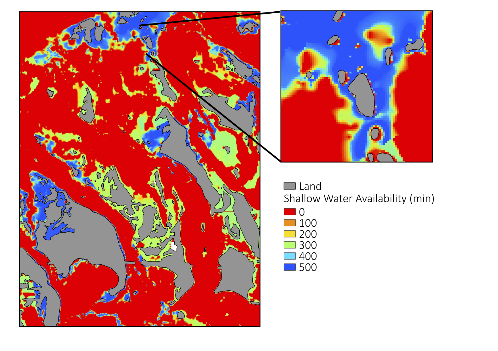

# timsa
Tidal Model of Shallow Water Availability

The spatially-explict model simulates change in water levels from tides and counts the amount of time (in minutes) that water levels are within a 'water-window', which represents an ecologically relevant range of water levels. Output is a gridded map.

**Citations**
Calle, L., Gawlik, D.E., Xie, Z., Green, L., Lapointe, B., and Strong, A.: Effects of tidal periodicities and diurnal foraging constraints on the density of foraging wading birds. The Auk, 133(3):378-396, doi:10.1642/AUK-15-234.1, 2016.

Calle, L., Green, L., Strong, A., and Gawlik, D.E.: Time‐integrated habitat availability is a resource attribute that informs patterns of use in intertidal areas. Ecological Monographs, 88(4):600-620, doi:10.1002/ecm.1305, 2018.

**Model Configuration and Options**:
<pre>
  Need to be specified in the configuration file ./timsa_drivers.conf

  Options:
    ...
    ...
  Inputs:
    ...
    ...
    
  Outputs:
    ./outputs/*swa.asc          //ascii raster
    ./outputs/fieldsummary.txt  //summary stats for entire area (sum,count,cellsize)
</pre>

**Usage**:
<pre>
  #compiles and checks for code or system conflicts 
  make clean; make

  #runs the model
  ./timsa ./timsa_drivers.conf
</pre>

**Sample plot of data from the 'fieldsummary.txt' output**

**Sample figure based on map from model output**

